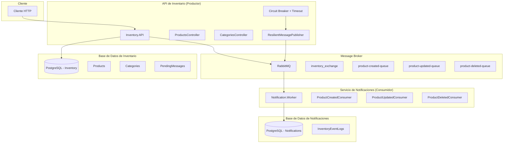
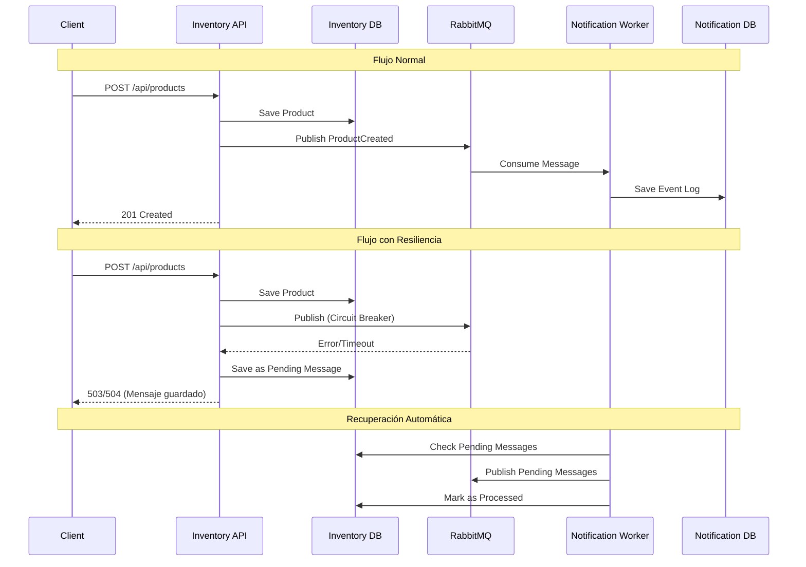
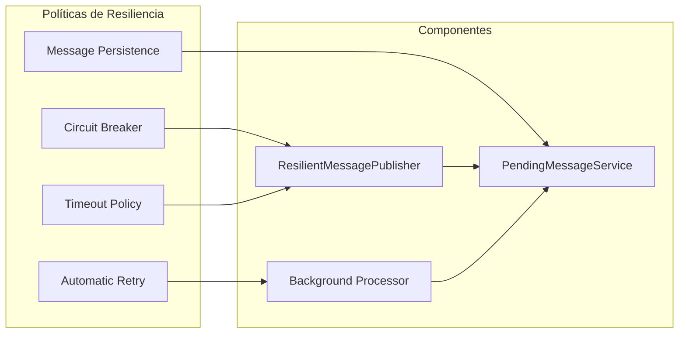

# Sistema de Notificaciones de Inventario - Arquitectura

## 🏗️ Diagrama de Arquitectura General



## 🔄 Flujo de Datos



## 🛡️ Patrones de Resiliencia Implementados



## 📋 Endpoints de la API

```mermaid
graph TD
    A[Inventory API] --> B[GET /api/products]
    A --> C[GET /api/products/{id}]
    A --> D[POST /api/products]
    A --> E[PUT /api/products/{id}]
    A --> F[DELETE /api/products/{id}]
    
    D --> G[ProductCreated Event]
    E --> H[ProductUpdated Event]
    F --> I[ProductDeleted Event]
    
    G --> J[RabbitMQ]
    H --> J
    I --> J
```

## 🎯 Características Principales

- ✅ **API REST completa** con todos los endpoints requeridos
- ✅ **Integración con RabbitMQ** usando exchange direct
- ✅ **Circuit Breaker + Timeout** para resiliencia
- ✅ **Persistencia de mensajes** para evitar pérdidas
- ✅ **Procesamiento automático** de mensajes pendientes
- ✅ **Docker Compose** para el ambiente completo
- ✅ **Documentación Swagger** incluida
- ✅ **Manejo de errores** y reintentos
- ✅ **Arquitectura limpia** con separación de responsabilidades 