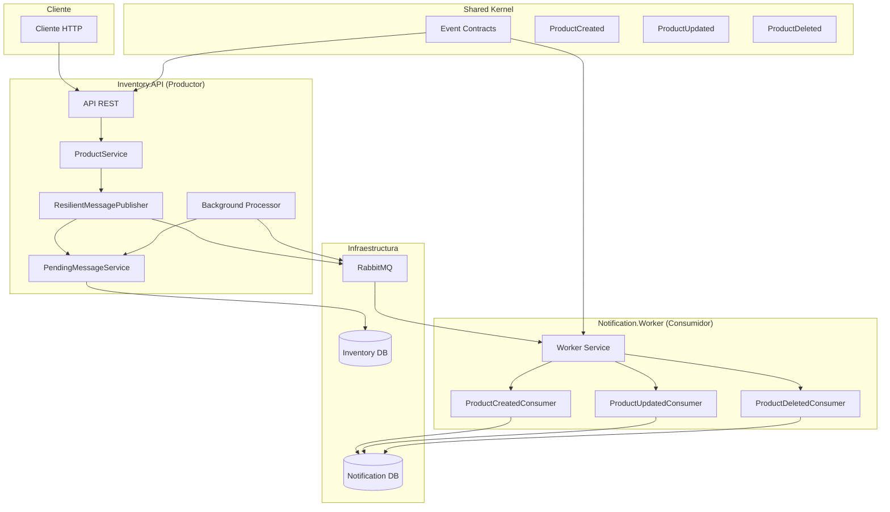
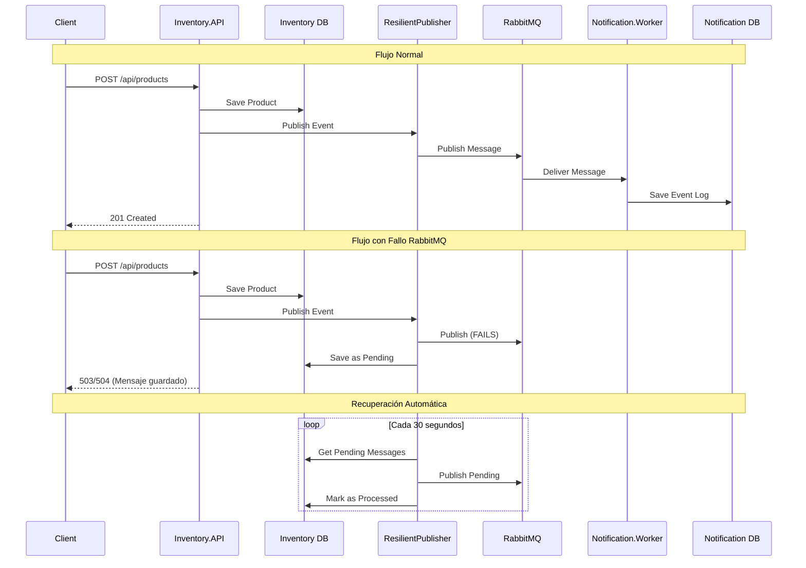
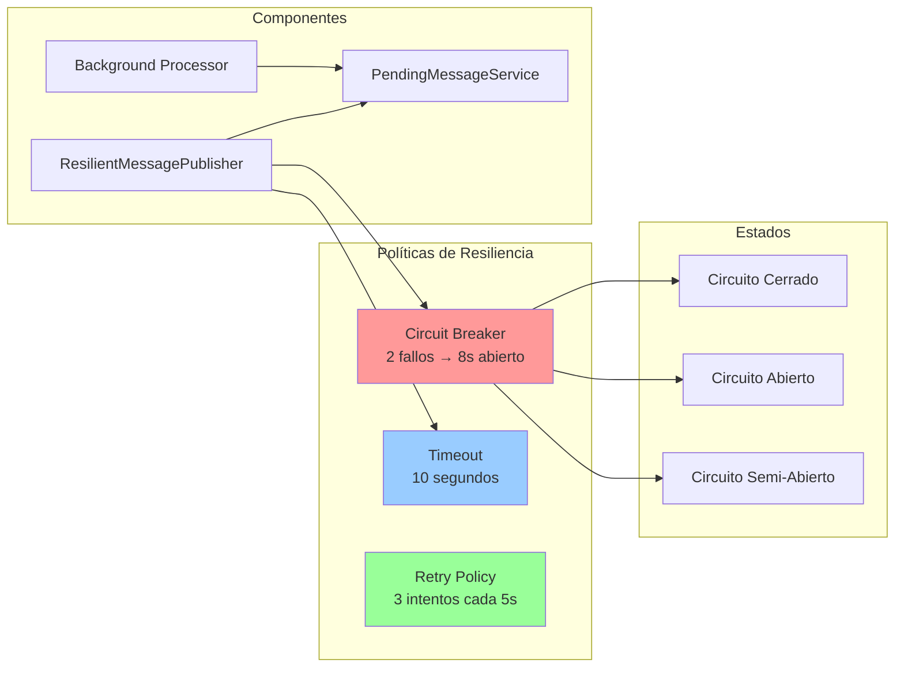
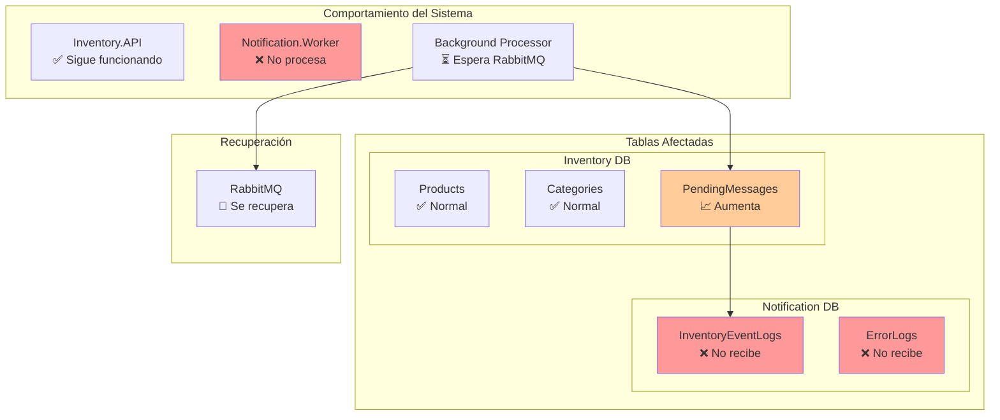
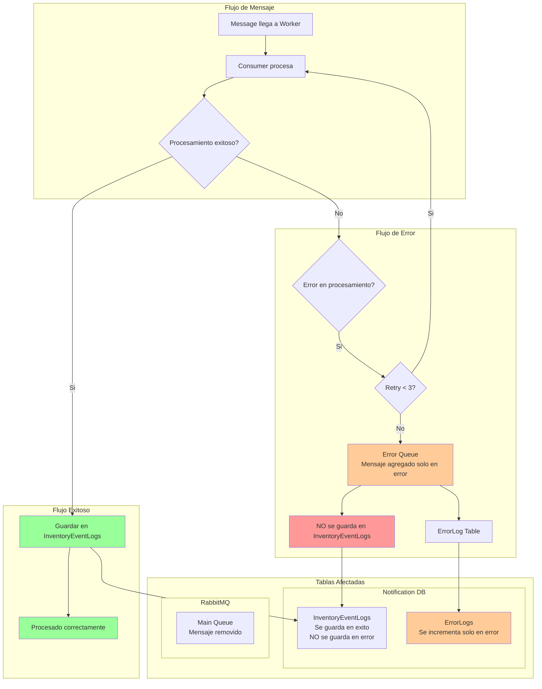
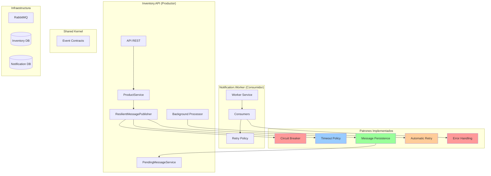

# Diagramas de Arquitectura - Kinetic

## 1. Arquitectura General de la Solución

## 2. Flujo de Patrones de Mensajería Implementados

## 3. Flujo de Patrones de Resiliencia Implementados

## 4. Caso de Uso: Cuando se cae RabbitMQ

## 5. Caso de Uso: Cuando la cola genera error

## 6. Resumen de Componentes y Responsabilidades

