# Diagramas de Arquitectura - Kinetic

## 1. Arquitectura General de la Solución

## 2. Flujo de Patrones de Mensajería Implementados

## 3. Flujo de Patrones de Resiliencia Implementados

```mermaid
graph LR
    subgraph "Políticas de Resiliencia"
        CB[Circuit Breaker<br/>2 fallos → 8s abierto]
        TO[Timeout<br/>10 segundos]
        RETRY[Retry Policy<br/>3 intentos cada 5s]
    end
    
    subgraph "Componentes"
        PUBLISHER[ResilientMessagePublisher]
        PENDING[PendingMessageService]
        PROCESSOR[Background Processor]
    end
    
    subgraph "Estados"
        CLOSED[Circuito Cerrado]
        OPEN[Circuito Abierto]
        HALF[Circuito Semi-Abierto]
    end
    
    PUBLISHER --> CB
    PUBLISHER --> TO
    PUBLISHER --> PENDING
    PROCESSOR --> PENDING
    
    CB --> CLOSED
    CB --> OPEN
    CB --> HALF
    
    style CB fill:#ff9999
    style TO fill:#99ccff
    style RETRY fill:#99ff99
```

## 4. Caso de Uso: Cuando se cae RabbitMQ

```mermaid
graph TD
    subgraph "Tablas Afectadas"
        subgraph "Inventory DB"
            Products[Products<br/>✅ Normal]
            Categories[Categories<br/>✅ Normal]
            PendingMessages[PendingMessages<br/>📈 Aumenta]
        end
        
        subgraph "Notification DB"
            InventoryEventLogs[InventoryEventLogs<br/>❌ No recibe]
            ErrorLogs[ErrorLogs<br/>❌ No recibe]
        end
    end
    
    subgraph "Comportamiento del Sistema"
        API[Inventory.API<br/>✅ Sigue funcionando]
        Worker[Notification.Worker<br/>❌ No procesa]
        Background[Background Processor<br/>⏳ Espera RabbitMQ]
    end
    
    subgraph "Recuperación"
        RabbitMQ[RabbitMQ<br/>🔄 Se recupera]
        Background --> RabbitMQ
        Background --> PendingMessages
        PendingMessages --> InventoryEventLogs
    end
    
    style PendingMessages fill:#ffcc99
    style InventoryEventLogs fill:#ff9999
    style ErrorLogs fill:#ff9999
    style Worker fill:#ff9999
```

## 5. Caso de Uso: Cuando la cola genera error

## 6. Resumen de Componentes y Responsabilidades

