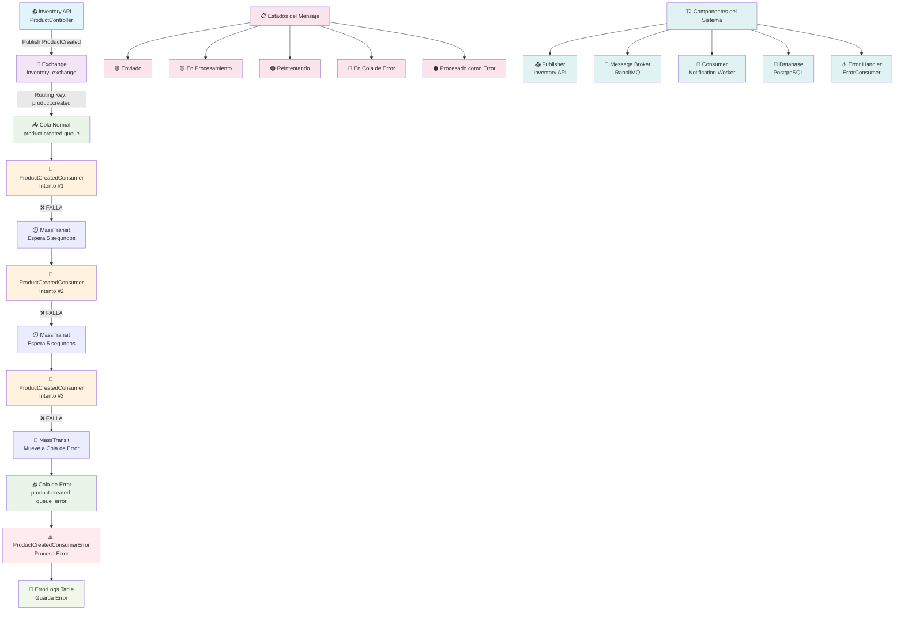
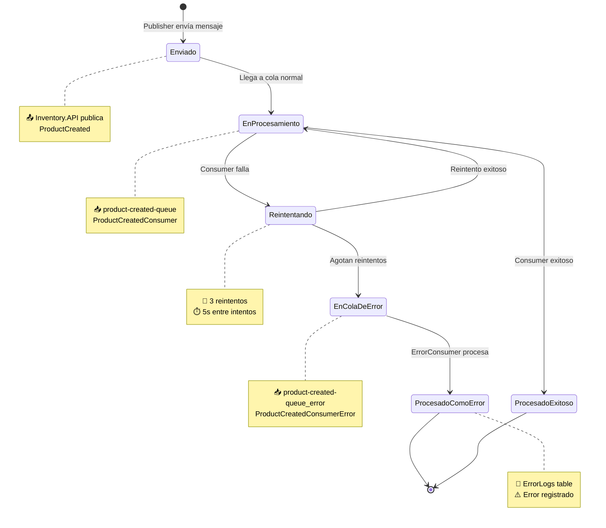
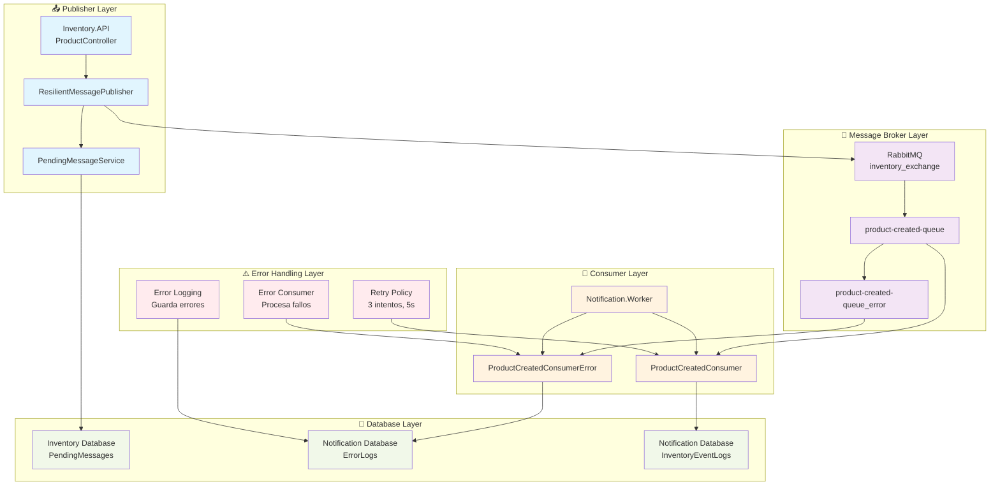
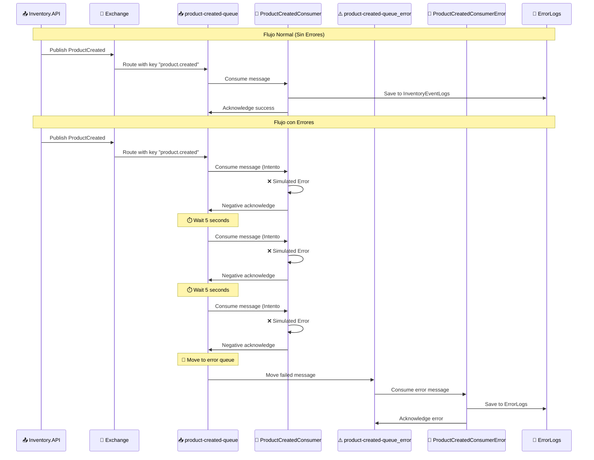
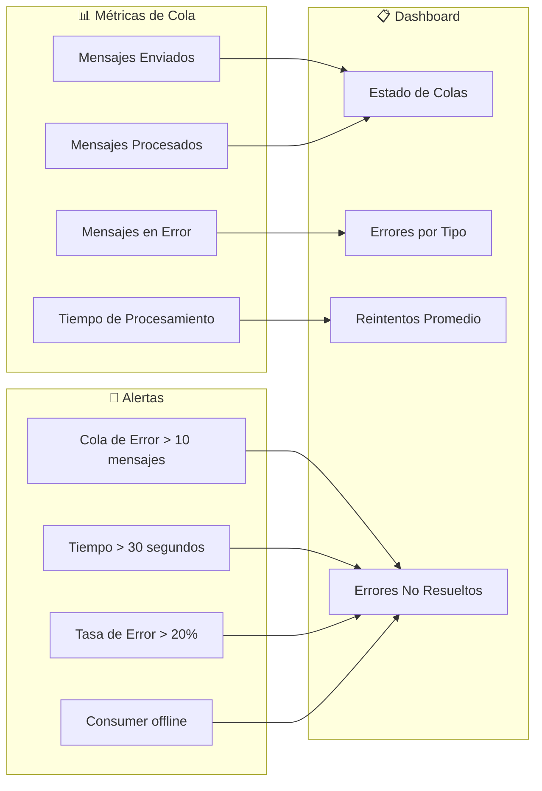

# Diagrama: Flujo de Manejo de Errores en Cola de Creación de Productos

## 🔄 **Flujo Completo de Manejo de Errores**

## 📊 **Estados del Mensaje**

## 🏗️ **Componentes del Sistema de Mensajes Pendientes**

## 🔍 **Detalle del Flujo de Error**

## 📈 **Métricas y Monitoreo**

## 🎯 **Resumen del Sistema**

### **Componentes Principales:**
1. **📤 Publisher**: Inventory.API que publica eventos
2. **📡 Message Broker**: RabbitMQ con exchange y colas
3. **🔄 Consumer**: Notification.Worker que procesa mensajes
4. **⚠️ Error Handler**: Sistema de manejo de errores
5. **💾 Database**: Almacenamiento de eventos y errores

### **Estados del Mensaje:**
1. **🟢 Enviado**: Publisher envía mensaje
2. **🟡 En Procesamiento**: Consumer intenta procesar
3. **🟠 Reintentando**: MassTransit reintenta (3 veces)
4. **🔴 En Cola de Error**: Mensaje falló después de reintentos
5. **⚫ Procesado como Error**: ErrorConsumer procesa el error

### **Flujo de Error:**
1. Consumer falla → MassTransit reintenta (3x, 5s)
2. Si todos fallan → Mensaje va a cola de error
3. ErrorConsumer procesa → Guarda en ErrorLogs
4. Sistema puede reintentar manualmente o notificar

**Este sistema garantiza que ningún mensaje se pierda y que todos los errores sean registrados y manejados apropiadamente.** 