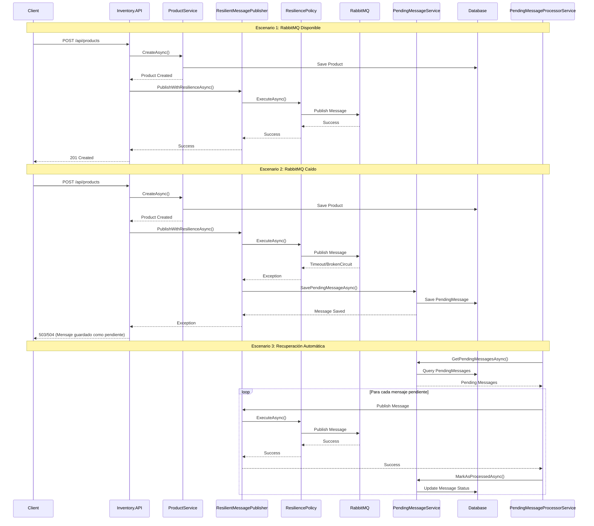
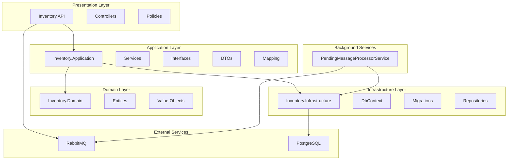
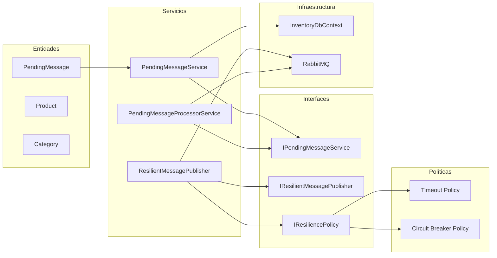
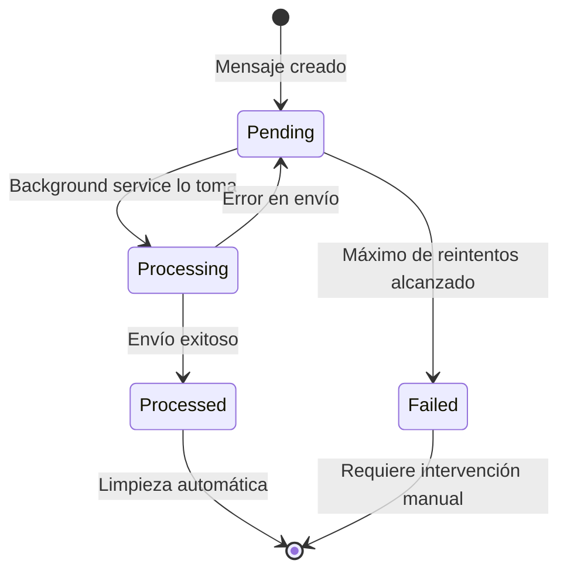

# Estructura del Proyecto Kinetic

## 📁 Estructura de Carpetas

```mermaid
graph TD
    A[Kinetic/] --> B[shared/]
    A --> C[src/]
    A --> D[tests/]
    A --> E[docker-compose.yml]
    
    B --> B1[SharedKernel/]
    B1 --> B2[Contracts/]
    B2 --> B3[ProductCreated.cs]
    B2 --> B4[ProductUpdated.cs]
    B2 --> B5[ProductDeleted.cs]
    
    C --> C1[Inventory/]
    C --> C2[Notification/]
    
    C1 --> C1A[Inventory.API/]
    C1 --> C1B[Inventory.Application/]
    C1 --> C1C[Inventory.Domain/]
    C1 --> C1D[Inventory.Infrastructure/]
    
    C1A --> C1A1[Controllers/]
    C1A --> C1A2[Policies/]
    C1A --> C1A3[Program.cs]
    
    C1A1 --> C1A1A[ProductsController.cs]
    C1A1 --> C1A1B[CategoriesController.cs]
    
    C1B --> C1B1[Services/]
    C1B --> C1B2[Interfaces/]
    C1B --> C1B3[DependencyInjection.cs]
    
    C1B1 --> C1B1A[ProductService.cs]
    C1B1 --> C1B1B[CategoryService.cs]
    C1B1 --> C1B1C[PendingMessageService.cs]
    C1B1 --> C1B1D[ResilientMessagePublisher.cs]
    C1B1 --> C1B1E[PendingMessageProcessorService.cs]
    
    C1B2 --> C1B2A[IProductService.cs]
    C1B2 --> C1B2B[ICategoryService.cs]
    C1B2 --> C1B2C[IPendingMessageService.cs]
    C1B2 --> C1B2D[IResilientMessagePublisher.cs]
    C1B2 --> C1B2E[IResiliencePolicy.cs]
    
    C1C --> C1C1[Entities/]
    C1C1 --> C1C1A[Product.cs]
    C1C1 --> C1C1B[Category.cs]
    C1C1 --> C1C1C[PendingMessage.cs]
    
    C1D --> C1D1[Migrations/]
    C1D --> C1D2[InventoryDbContext.cs]
    C1D --> C1D3[DbInitializer.cs]
    
    C2 --> C2A[Notification.Worker/]
    C2 --> C2B[Notification.Application/]
    C2 --> C2C[Notification.Domain/]
    C2 --> C2D[Notification.Infrastructure/]
    
    C2A --> C2A1[Consumers/]
    C2A --> C2A2[Program.cs]
    C2A --> C2A3[Worker.cs]
    
    C2A1 --> C2A1A[ProductCreatedConsumer.cs]
    C2A1 --> C2A1B[ProductUpdatedConsumer.cs]
    C2A1 --> C2A1C[ProductDeletedConsumer.cs]
    
    D --> D1[Inventory.Tests/]
    D --> D2[Notification.Tests/]
    
    D1 --> D1A[Controllers/]
    D1A --> D1A1[ProductsControllerTests.cs]
```

## 🔄 Flujo de Mensajes Pendientes

## 🏗️ Arquitectura de Capas

## 🔧 Componentes del Sistema de Mensajes Pendientes

## 📊 Estados de los Mensajes

## 🎯 Beneficios del Sistema

- ✅ **No pérdida de mensajes** cuando RabbitMQ está caído
- ✅ **Procesamiento automático** cuando el servicio se recupera
- ✅ **Reintentos inteligentes** con límite configurable
- ✅ **Monitoreo detallado** con logs estructurados
- ✅ **Limpieza automática** de mensajes procesados
- ✅ **Escalabilidad** con procesamiento en background
- ✅ **Resiliencia** con políticas de timeout y circuit breaker 