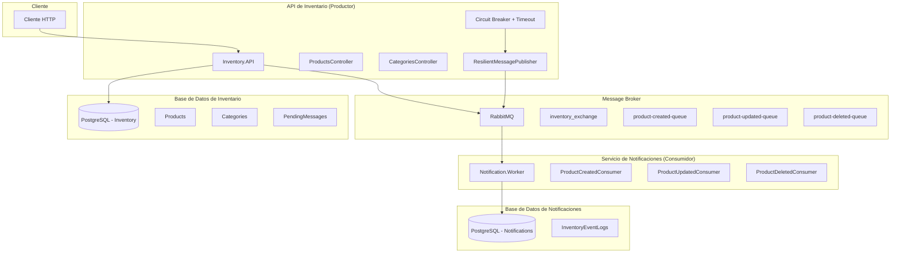
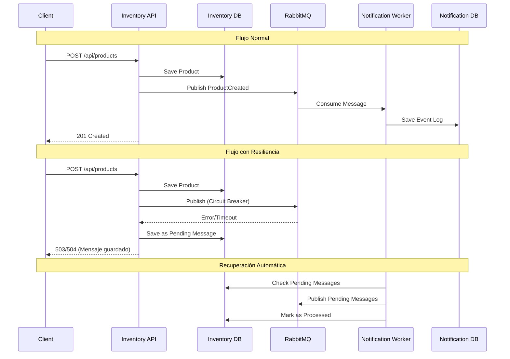
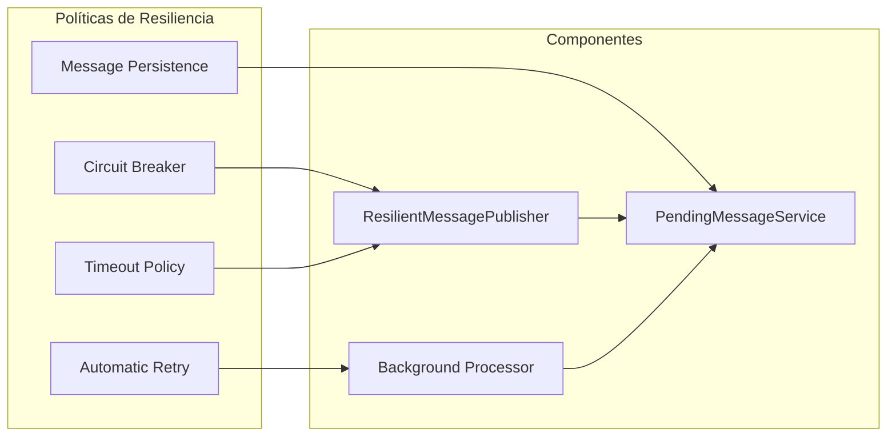
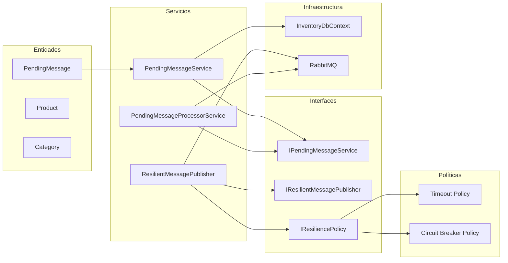
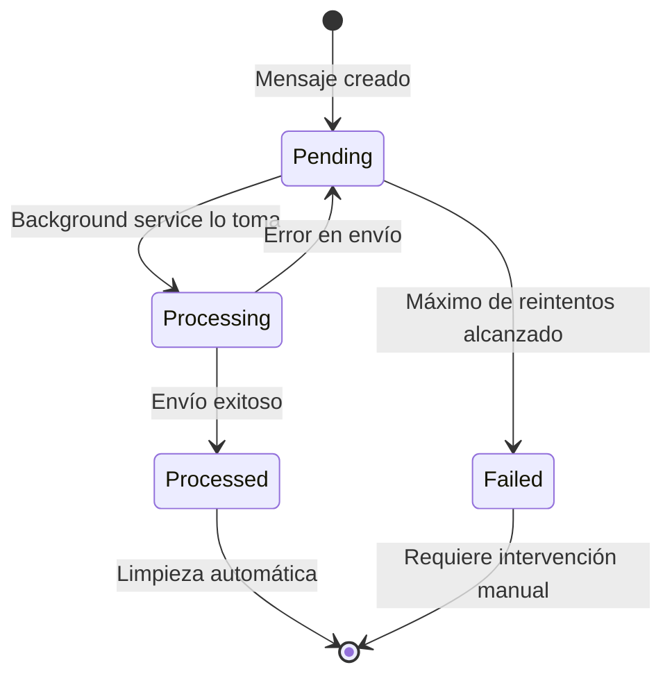
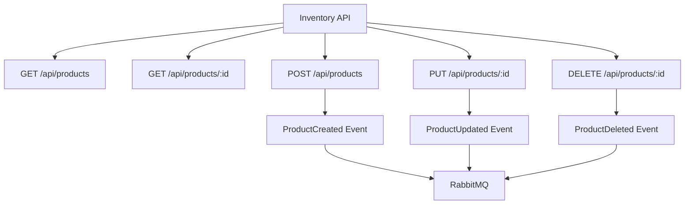

# Kinetic - Sistema de Notificaciones de Inventario - Arquitectura

## Diagrama de Arquitectura General



## Flujo de Datos



## Patrones de Resiliencia Implementados



## Componentes del Sistema de Mensajes Pendientes



## Estados de los Mensajes



## Endpoints de la API

[http://localhost:5000/swagger/index.html](http://localhost:5000/swagger/index.html)



## Pruebas con Postman

### Descargar la Colección
Para facilitar las pruebas de la API, hemos creado una colección de Postman que incluye todos los endpoints disponibles.

1. **Descargar la colección**: [Kinetic.postman_collection.json](Kinetic.postman_collection.json)
2. **Importar en Postman**:
   - Abrir Postman
   - Hacer clic en "Import"
   - Seleccionar el archivo `Kinetic.postman_collection.json`
   - La colección se importará automáticamente

### Configuración del Ambiente Local
Antes de usar la colección, asegúrate de:

1. **Iniciar los servicios**:
   ```bash
   docker-compose up -d
   cd src/Inventory/Inventory.API
   dotnet run
   ```

2. **Verificar que la API esté corriendo** en: `http://localhost:5000`

3. **Configurar variables de entorno** en Postman (opcional):
   - `base_url`: `http://localhost:5000`
   - `api_version`: `v1`

### Endpoints Incluidos en la Colección

#### **Productos**
- `GET /api/products` - Obtener todos los productos
- `GET /api/products/{id}` - Obtener producto por ID
- `POST /api/products` - Crear nuevo producto
- `PUT /api/products/{id}` - Actualizar producto
- `DELETE /api/products/{id}` - Eliminar producto

#### **Categorías**
- `GET /api/categories` - Obtener todas las categorías
- `GET /api/categories/{id}` - Obtener categoría por ID
- `POST /api/categories` - Crear nueva categoría
- `PUT /api/categories/{id}` - Actualizar categoría
- `DELETE /api/categories/{id}` - Eliminar categoría

### Ejemplos de Uso

#### **Crear un Producto**
```json
POST /api/products
{
  "name": "Producto de Prueba",
  "description": "Descripción del producto",
  "price": 99.99,
  "categoryId": 1
}
```

#### **Crear una Categoría**
```json
POST /api/categories
{
  "name": "Electrónicos",
  "description": "Productos electrónicos"
}
```

### Monitoreo de Eventos
Después de ejecutar las pruebas, puedes verificar que los eventos se procesaron correctamente:

1. **RabbitMQ Management UI**: `http://localhost:15672`
   - Usuario: `rabbitAdmin`
   - Contraseña: `secretPassword`

2. **Base de datos de notificaciones**:
   ```sql
   SELECT * FROM "InventoryEventLogs" ORDER BY "ReceivedAt" DESC;
   ```

### Notas Importantes
- La colección incluye ejemplos de datos para cada endpoint
- Los IDs se generan automáticamente por la base de datos
- Los eventos se procesan de forma asíncrona por el Notification.Worker
- Puedes usar la colección para probar el manejo de errores y reintentos

## Características Principales

- **API REST completa** con todos los endpoints requeridos
- **Integración con RabbitMQ** usando exchange direct
- **Circuit Breaker + Timeout** para resiliencia
- **Persistencia de mensajes** para evitar pérdidas
- **Procesamiento automático** de mensajes pendientes
- **Docker Compose** para el ambiente completo
- **Documentación Swagger** incluida
- **Manejo de errores** y reintentos
- **Arquitectura limpia** con separación de responsabilidades 

## Beneficios del Sistema

- **No pérdida de mensajes** cuando RabbitMQ está caído
- **Procesamiento automático** cuando el servicio se recupera
- **Reintentos inteligentes** con límite configurable
- **Monitoreo detallado** con logs estructurados
- **Limpieza automática** de mensajes procesados
- **Escalabilidad** con procesamiento en background
- **Resiliencia** con políticas de timeout y circuit breaker 

### Docker Compose para el Sistema de Notificaciones de Inventario
**Desde la raíz donde se clono el repositorio (donde está el docker-compose)**

#### Detener y eliminar recursos de Docker Compose
```
docker-compose down --volumes --remove-orphans
```

#### Borrar contenedores detenidos, volúmenes sin usar, imágenes y redes no referenciadas
```
docker container prune -f
```

#### Eliminar volúmenes sin usar
```
docker volume prune -f
```

#### Eliminar redes no utilizadas
```
docker network prune -f
```

#### (Opcional) Eliminar imágenes no utilizadas 
```
docker image prune -a -f
```

#### Levantar el docker compose
```
docker-compose up -d
```


## Migraciones EF Core (en modo desarrollo)
#### Setear  como proyecto principal API y en Package Manager Console (apuntando a Infrastructure) ejecutar los siguientes comandos:
```

Add-Migration Initial -Context InventoryDbContext -OutputDir Migrations
Update-Database  -Context InventoryDbContext
Remove-Migration -Context InventoryDbContext
```

#### Setear  como proyecto principal Worker y en Package Manager Console (apuntando a Infrastructure) ejecutar los siguientes comandos:
```
Add-Migration Initial -Context NotificationDbContext -OutputDir Migrations
Update-Database  -Context NotificationDbContext
Remove-Migration -Context NotificationDbContext
```
