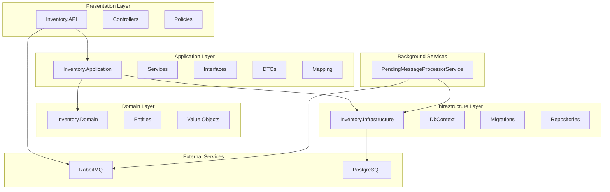

```mermaid
stateDiagram-v2
    [*] --> Pending: Mensaje creado
    Pending --> Processing: Background service lo toma
    Processing --> Processed: Envío exitoso
    Processing --> Pending: Error en envío
    Pending --> Failed: Máximo de reintentos alcanzado
    Processed --> [*]: Limpieza automática
    Failed --> [*]: Requiere intervención manual
```

# Kinetic
# Estructura del Proyecto Kinetic

## 📁 Estructura de Carpetas

```mermaid
graph TD
    A[Kinetic/] --> B[shared/]
    A --> C[src/]
    A --> D[tests/]
    A --> E[docker-compose.yml]
    
    B --> B1[SharedKernel/]
    B1 --> B2[Contracts/]
    B2 --> B3[ProductCreated.cs]
    B2 --> B4[ProductUpdated.cs]
    B2 --> B5[ProductDeleted.cs]
    
    C --> C1[Inventory/]
    C --> C2[Notification/]
    
    C1 --> C1A[Inventory.API/]
    C1 --> C1B[Inventory.Application/]
    C1 --> C1C[Inventory.Domain/]
    C1 --> C1D[Inventory.Infrastructure/]
    
    C1A --> C1A1[Controllers/]
    C1A --> C1A2[Policies/]
    C1A --> C1A3[Program.cs]
    
    C1A1 --> C1A1A[ProductsController.cs]
    C1A1 --> C1A1B[CategoriesController.cs]
    
    C1B --> C1B1[Services/]
    C1B --> C1B2[Interfaces/]
    C1B --> C1B3[DependencyInjection.cs]
    
    C1B1 --> C1B1A[ProductService.cs]
    C1B1 --> C1B1B[CategoryService.cs]
    C1B1 --> C1B1C[PendingMessageService.cs]
    C1B1 --> C1B1D[ResilientMessagePublisher.cs]
    C1B1 --> C1B1E[PendingMessageProcessorService.cs]
    
    C1B2 --> C1B2A[IProductService.cs]
    C1B2 --> C1B2B[ICategoryService.cs]
    C1B2 --> C1B2C[IPendingMessageService.cs]
    C1B2 --> C1B2D[IResilientMessagePublisher.cs]
    C1B2 --> C1B2E[IResiliencePolicy.cs]
    
    C1C --> C1C1[Entities/]
    C1C1 --> C1C1A[Product.cs]
    C1C1 --> C1C1B[Category.cs]
    C1C1 --> C1C1C[PendingMessage.cs]
    
    C1D --> C1D1[Migrations/]
    C1D --> C1D2[InventoryDbContext.cs]
    C1D --> C1D3[DbInitializer.cs]
    
    C2 --> C2A[Notification.Worker/]
    C2 --> C2B[Notification.Application/]
    C2 --> C2C[Notification.Domain/]
    C2 --> C2D[Notification.Infrastructure/]
    
    C2A --> C2A1[Consumers/]
    C2A --> C2A2[Program.cs]
    C2A --> C2A3[Worker.cs]
    
    C2A1 --> C2A1A[ProductCreatedConsumer.cs]
    C2A1 --> C2A1B[ProductUpdatedConsumer.cs]
    C2A1 --> C2A1C[ProductDeletedConsumer.cs]
    
    D --> D1[Inventory.Tests/]
    D --> D2[Notification.Tests/]
    
    D1 --> D1A[Controllers/]
    D1A --> D1A1[ProductsControllerTests.cs]
```



## 🔄 Flujo de Mensajes Pendientes

```mermaid
sequenceDiagram
    participant Client
    participant API as Inventory.API
    participant Service as ProductService
    participant Publisher as ResilientMessagePublisher
    participant Policy as ResiliencePolicy
    participant RabbitMQ
    participant PendingService as PendingMessageService
    participant DB as Database
    participant Background as PendingMessageProcessorService

    Note over Client,Background: Escenario 1: RabbitMQ Disponible
    Client->>API: POST /api/products
    API->>Service: CreateAsync()
    Service->>DB: Save Product
    Service-->>API: Product Created
    API->>Publisher: PublishWithResilienceAsync()
    Publisher->>Policy: ExecuteAsync()
    Policy->>RabbitMQ: Publish Message
    RabbitMQ-->>Policy: Success
    Policy-->>Publisher: Success
    Publisher-->>API: Success
    API-->>Client: 201 Created

    Note over Client,Background: Escenario 2: RabbitMQ Caído
    Client->>API: POST /api/products
    API->>Service: CreateAsync()
    Service->>DB: Save Product
    Service-->>API: Product Created
    API->>Publisher: PublishWithResilienceAsync()
    Publisher->>Policy: ExecuteAsync()
    Policy->>RabbitMQ: Publish Message
    RabbitMQ-->>Policy: Timeout/BrokenCircuit
    Policy-->>Publisher: Exception
    Publisher->>PendingService: SavePendingMessageAsync()
    PendingService->>DB: Save PendingMessage
    PendingService-->>Publisher: Message Saved
    Publisher-->>API: Exception
    API-->>Client: 503/504 (Mensaje guardado como pendiente)

    Note over Client,Background: Escenario 3: Recuperación Automática
    Background->>PendingService: GetPendingMessagesAsync()
    PendingService->>DB: Query PendingMessages
    PendingService-->>Background: Pending Messages
    loop Para cada mensaje pendiente
        Background->>Publisher: Publish Message
        Publisher->>Policy: ExecuteAsync()
        Policy->>RabbitMQ: Publish Message
        RabbitMQ-->>Policy: Success
        Policy-->>Publisher: Success
        Publisher-->>Background: Success
        Background->>PendingService: MarkAsProcessedAsync()
        PendingService->>DB: Update Message Status
    end
```



## 🏗️ Arquitectura de Capas



## 🔧 Componentes del Sistema de Mensajes Pendientes


## 📊 Estados de los Mensajes



## 🎯 Beneficios del Sistema

- ✅ **No pérdida de mensajes** cuando RabbitMQ está caído
- ✅ **Procesamiento automático** cuando el servicio se recupera
- ✅ **Reintentos inteligentes** con límite configurable
- ✅ **Monitoreo detallado** con logs estructurados
- ✅ **Limpieza automática** de mensajes procesados
- ✅ **Escalabilidad** con procesamiento en background
- ✅ **Resiliencia** con políticas de timeout y circuit breaker 


docker-compose down -v
docker volume prune -f
docker volume ls
docker volume rm inventory_volume notification_volume

docker system prune --all --volumes

docker-compose up -d


docker-compose down

docker volume ls


docker system prune --help


docker volume ls

docker volume prune -f
docker volume ls


docker rm -f $(docker ps -aq)

docker volume rm $(docker volume ls -q)

docker rm -f $(docker ps -aq)            # elimina todos los contenedores
docker volume rm $(docker volume ls -q)  # elimina todos los volúmenes


[Inventario.API] -- POST /api/products
       |
    Envía mensaje a RabbitMQ (exchange: inventory_exchange, routingKey: product_created)
       |
[RabbitMQ] --> Cola: product_created
       |
[Notificaciones.Worker] -- escucha cola y guarda en su base de datos


services:
  rabbitmq:
    image: rabbitmq:3-management
    ports:
      - "5672:5672"
      - "15672:15672"
    environment:
      RABBITMQ_DEFAULT_USER: guest
      RABBITMQ_DEFAULT_PASS: guest

  postgres:
    image: postgres:14
    environment:
      POSTGRES_USER: postgres
      POSTGRES_PASSWORD: postgres
      POSTGRES_DB: notificationsdb
    ports:
      - "5432:5432"

  inventory-api:
    build:
      context: ./Inventory.API
    ports:
      - "5000:80"
    depends_on:
      - rabbitmq
      - postgres

  notification-worker:
    build:
      context: ./Notification.Worker
    depends_on:
      - rabbitmq
      - postgres


# Kinetic

## Inventory

```
docker run --name inventory-db -e POSTGRES_USER=BenjAdmin -e POSTGRES_PASSWORD=MySecretPassword -e POSTGRES_DB=inventory-db -p 5432:5432 -d postgres:17.5-alpine
```

```
AddPendingMessagesTable
Add-Migration AddPendingMessagesTable -Context InventoryDbContext -OutputDir Migrations
Update-Database  -Context InventoryDbContext
```

## Notification

```
docker run --name notification-db -e POSTGRES_USER=BenjAdmin -e POSTGRES_PASSWORD=MySecretPassword -e POSTGRES_DB=notification-db -p 5433:5432 -d postgres:17.5-alpine
```

```
Add-Migration Initial -Context NotificationDbContext -OutputDir Migrations
Update-Database  -Context NotificationDbContext

Remove-Migration -Context NotificationDbContext
```


/Kinetic
├── src/
│   ├── Inventory/
│   │   ├── Inventory.API/
│   │   ├── Inventory.Application/
│   │   ├── Inventory.Domain/
│   │   └── Inventory.Infrastructure/
│   └── Notification/
│       ├── Notification.Worker/
│       ├── Notification.Application/
│       ├── Notification.Domain/
│       └── Notification.Infrastructure/
├── docker-compose.yml
├── Kinetic.sln
├── README.md


🧱 Ejemplo de estructura:
/InventorySystem.sln
├── Inventory.API/
├── Inventory.Application/
├── Inventory.Infrastructure/
├── Inventory.Domain/
│
├── Notification.Worker/
├── Notification.Application/
├── Notification.Infrastructure/
├── Notification.Domain/
│
├── BuildingBlocks/ (opcional: para clases compartidas)
├── docker-compose.yml
└── README.md


🧱 Estructura recomendada para la solución Kinetic


/Kinetic
│
├── Kinetic.sln
├── docker-compose.yml
├── README.md
│
├── src/
│   ├── Inventory/
│   │   ├── Inventory.API/               --> ASP.NET Core Web API
│   │   ├── Inventory.Application/       --> lógica de aplicación (DTOs, servicios)
│   │   ├── Inventory.Domain/            --> entidades de dominio
│   │   └── Inventory.Infrastructure/    --> EF Core, RabbitMQ publisher, etc.
│   │
│   ├── Notification/
│   │   ├── Notification.Worker/         --> Worker Service .NET Core
│   │   ├── Notification.Application/    --> lógica de aplicación
│   │   ├── Notification.Domain/         --> entidades (log de eventos)
│   │   └── Notification.Infrastructure/ --> EF Core, RabbitMQ consumer, etc.
│
├── shared/                              --> (opcional) código común
│   └── Kinetic.SharedKernel/            --> clases base, excepciones, interfaces comunes
│
└── tests/                               --> (opcional) tests de unidad e integración
    ├── Inventory.Tests/
    └── Notification.Tests/


    Cómo agregar los proyectos a la solución?
Desde la raíz del proyecto (/Kinetic):

dotnet new sln -n Kinetic

# Agregar proyectos
dotnet sln add ./src/Inventory/Inventory.API/Inventory.API.csproj
dotnet sln add ./src/Inventory/Inventory.Application/Inventory.Application.csproj
dotnet sln add ./src/Inventory/Inventory.Domain/Inventory.Domain.csproj
dotnet sln add ./src/Inventory/Inventory.Infrastructure/Inventory.Infrastructure.csproj

dotnet sln add ./src/Notification/Notification.Worker/Notification.Worker.csproj
dotnet sln add ./src/Notification/Notification.Application/Notification.Application.csproj
dotnet sln add ./src/Notification/Notification.Domain/Notification.Domain.csproj
dotnet sln add ./src/Notification/Notification.Infrastructure/Notification.Infrastructure.csproj

# (opcional)
dotnet sln add ./shared/Kinetic.SharedKernel/Kinetic.SharedKernel.csproj
