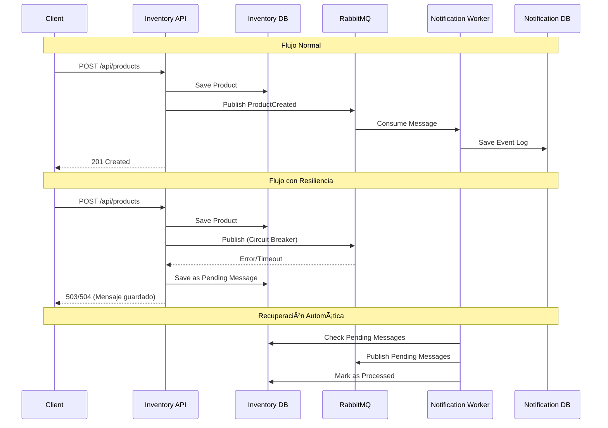
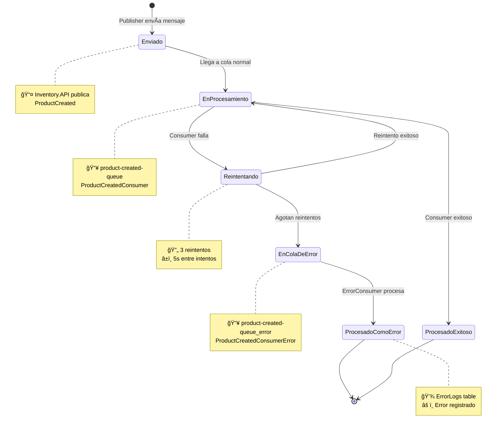
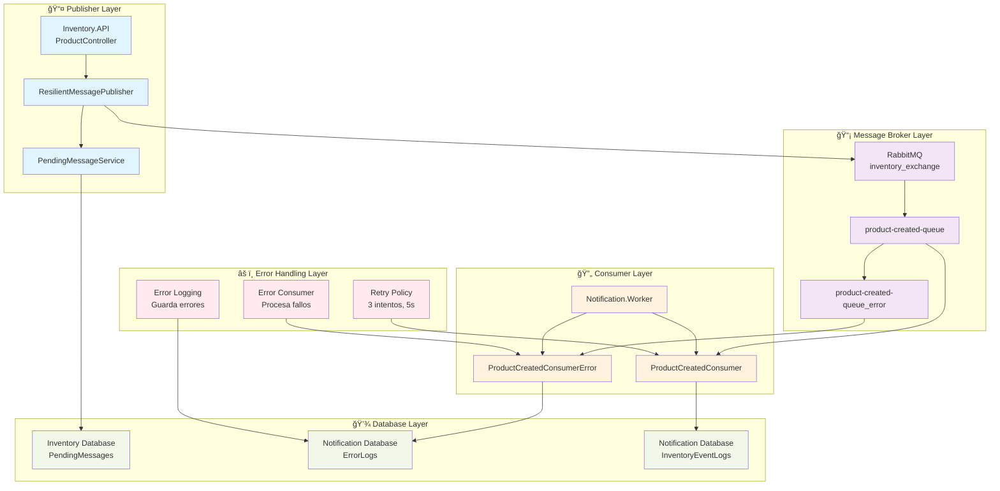
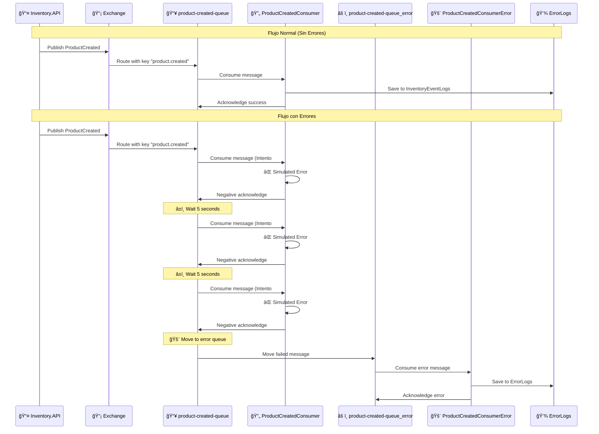
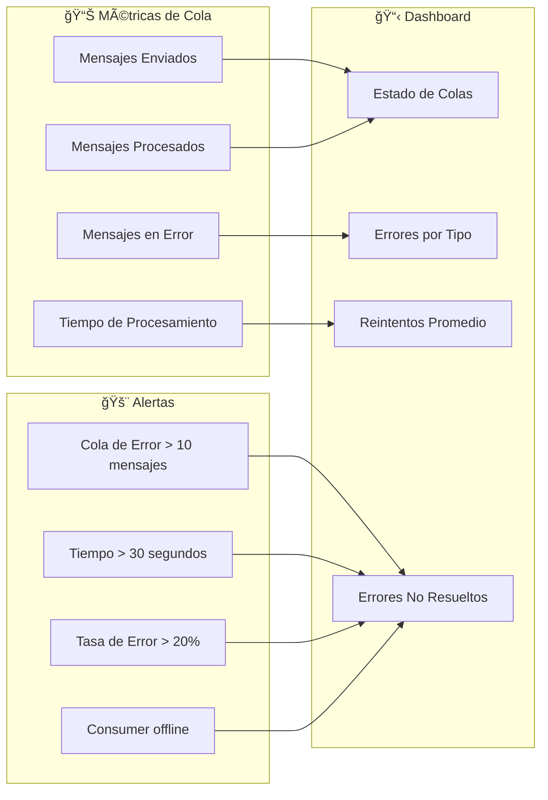

# Kinetic - Sistema de Notificaciones de Inventario - Arquitectura

## Diagrama de Arquitectura General


# Limpieza de Docker y Levantamiento del Entorno Local

> Ejecutar desde la raíz del proyecto, donde se encuentra el archivo `docker-compose.yml`.

---

### 1. Detener y eliminar recursos de Docker Compose

```
docker-compose down --volumes --remove-orphans
```

---

### 2. Limpiar recursos de Docker no utilizados

```
docker container prune -f      # Eliminar contenedores detenidos
docker volume prune -f         # Eliminar volúmenes no utilizados
docker network prune -f        # Eliminar redes no utilizadas
docker image prune -a -f       # (Opcional) Eliminar imágenes no utilizadas
```

---

### 3. Levantar el entorno con nuevo build

```
docker-compose up -d --build
```

---


## Endpoints de la API

[http://localhost:5000/swagger/index.html](http://localhost:5000/swagger/index.html)


## Pruebas con Postman

### Descargar la Colección
Para facilitar las pruebas de la API, hemos creado una colección de Postman que incluye todos los endpoints disponibles.

1. **Descargar la colección**: [Kinetic.postman_collection.json](Kinetic.postman_collection.json)
2. **Importar en Postman**:
   - Abrir Postman
   - Hacer clic en "File" y luego "Import"
   - Seleccionar el archivo `Kinetic.postman_collection.json`
   - La colección se importará automáticamente

### Endpoints Incluidos en la Colección

#### **Productos**
- `GET /api/products` - Obtener todos los productos
- `GET /api/products/{id}` - Obtener producto por ID
- `POST /api/products` - Crear nuevo producto
- `PUT /api/products/{id}` - Actualizar producto
- `DELETE /api/products/{id}` - Eliminar producto

#### **Categorías**
- `GET /api/categories` - Obtener todas las categorías

### Ejemplos de Uso

#### **Crear un Producto**
```json
POST /api/products
{
  "name": "Producto de Prueba",
  "description": "Descripción del producto",
  "price": 99.99,
  "categoryId": 1
}
```


## Flujo de Datos



## Patrones de Resiliencia Implementados


## Componentes del Sistema de Mensajes Pendientes


## Estados de los Mensajes

```mermaid
stateDiagram-v2
    [*] --> Pending: Mensaje creado
    Pending --> Processing: Background service lo toma
    Processing --> Processed: Envío exitoso
    Processing --> Pending: Error en envío
    Pending --> Failed: Máximo de reintentos alcanzado
    Processed --> [*]: Limpieza automática
    Failed --> [*]: Requiere intervención manual
```




### Monitoreo de Eventos
Después de ejecutar las pruebas, puedes verificar que los eventos se procesaron correctamente:

1. **RabbitMQ Management UI**: `http://localhost:15672`
   - Usuario: `rabbitAdmin`
   - Contraseña: `secretPassword`

2. **Base de datos de notificaciones**:
   ```sql
   SELECT * FROM "InventoryEventLogs" ORDER BY "ReceivedAt" DESC;
   ```

### Notas Importantes
- La colección incluye ejemplos de datos para cada endpoint
- Los IDs se generan automáticamente por la base de datos
- Los eventos se procesan de forma asíncrona por el Notification.Worker
- Puedes usar la colección para probar el manejo de errores y reintentos

## Características Principales

- **API REST completa** con todos los endpoints requeridos
- **Integración con RabbitMQ** usando exchange direct
- **Circuit Breaker + Timeout** para resiliencia
- **Persistencia de mensajes** para evitar pérdidas
- **Procesamiento automático** de mensajes pendientes
- **Docker Compose** para el ambiente completo
- **Documentación Swagger** incluida
- **Manejo de errores** y reintentos
- **Arquitectura limpia** con separación de responsabilidades 

## Beneficios del Sistema

- **No pérdida de mensajes** cuando RabbitMQ está caído
- **Procesamiento automático** cuando el servicio se recupera
- **Reintentos inteligentes** con límite configurable
- **Monitoreo detallado** con logs estructurados
- **Limpieza automática** de mensajes procesados
- **Escalabilidad** con procesamiento en background
- **Resiliencia** con políticas de timeout y circuit breaker 


## Migraciones EF Core (en modo desarrollo)
#### Setear  como proyecto principal API y en Package Manager Console (apuntando a Infrastructure) ejecutar los siguientes comandos:
```

Add-Migration Initial -Context InventoryDbContext -OutputDir Migrations
Update-Database  -Context InventoryDbContext
Remove-Migration -Context InventoryDbContext
```

#### Setear  como proyecto principal Worker y en Package Manager Console (apuntando a Infrastructure) ejecutar los siguientes comandos:
```
Add-Migration Initial -Context NotificationDbContext -OutputDir Migrations
Update-Database  -Context NotificationDbContext
Remove-Migration -Context NotificationDbContext
```


## 📊 **Estados del Mensaje**



## 🏗️ **Componentes del Sistema de Mensajes Pendientes**



## 🔍 **Detalle del Flujo de Error**



## 📈 **Métricas y Monitoreo**



## 🎯 **Resumen del Sistema**

### **Componentes Principales:**
1. **📤 Publisher**: Inventory.API que publica eventos
2. **📡 Message Broker**: RabbitMQ con exchange y colas
3. **🔄 Consumer**: Notification.Worker que procesa mensajes
4. **⚠️ Error Handler**: Sistema de manejo de errores
5. **💾 Database**: Almacenamiento de eventos y errores

### **Estados del Mensaje:**
1. **🟢 Enviado**: Publisher envía mensaje
2. **🟡 En Procesamiento**: Consumer intenta procesar
3. **🟠 Reintentando**: MassTransit reintenta (3 veces)
4. **🔴 En Cola de Error**: Mensaje falló después de reintentos
5. **⚫ Procesado como Error**: ErrorConsumer procesa el error

### **Flujo de Error:**
1. Consumer falla → MassTransit reintenta (3x, 5s)
2. Si todos fallan → Mensaje va a cola de error
3. ErrorConsumer procesa → Guarda en ErrorLogs
4. Sistema puede reintentar manualmente o notificar

**Este sistema garantiza que ningún mensaje se pierda y que todos los errores sean registrados y manejados apropiadamente.** 